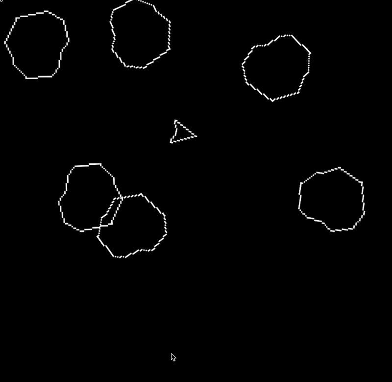

# SpaceRocks 🚀

**SpaceRocks** is a classic 2D arcade space shooter built in **GameMaker**, inspired by retro asteroid games where quick reflexes and smooth controls are everything.

Destroy incoming space rocks, master your ship’s movement, and survive as long as you can — all while learning the fundamentals of game mechanics, physics, and input handling in a real project.

---

## 🎮 Gameplay Demo



---

## 🎮 Gameplay

In this game, you:

- Navigate your spaceship with smooth rotation and thrust
- Rotate with **Left / Right**
- Move forward with **Up**
- Shoot with **Space** or mouse click
- Dodge incoming rocks and survive as long as possible

The game captures the simplicity and excitement of classic arcade shooters like *Asteroids* but coded from scratch in GameMaker using GML (GameMaker Language).

---

## 🛠️ Built With

- **GameMaker Studio**  
- **GML (GameMaker Language)**  
- Ship movement, input handling, projectile spawning  
- Simple physics and collision detection

This project was an early deep dive into game development and taught fundamental concepts like motion, events, keyboard & mouse input, spawning objects, and game loop logic.

---

## 📦 Getting Started

To try this project yourself:

1. Clone the repo:
   ```sh
   git clone https://github.com/kashafbatool/spacerocks.git

